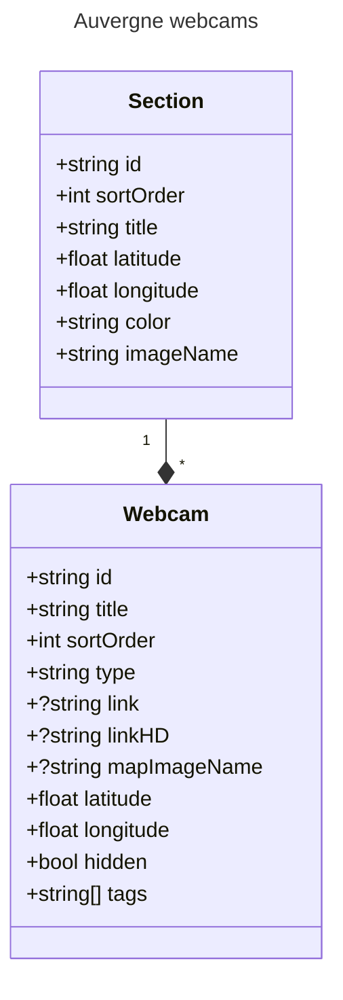

# Auvergne Webcams

Web application and API

## Front 

display the content of the Webcams available in Auvergne - France

## API 

Send webcams to mobile applications

## Modele

## Constants

### Webcam type
- image
- viewsurf

### Webcam mapImageName
- map-annotation-mountain
- map-annotation-lake
- map-annotation-road
- map-annotation-city
- map-annotation-highway

### Section imageName
- pdd-landscape
- waterfall-landscape
- goal-landscape
- mountain-landscape-1
- mountain-landscape-2
- lioran-landscape
- cf-landscape
- road-landscape
- car-landscape
- aurillac-landscape
- allier-landscape
- hl-landscape

